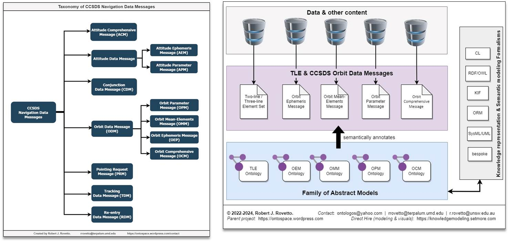

# The Family of CCSDS Navigation Data Messages Ontologies
A suite of abstract models of and for the [CCSDS](https://public.ccsds.org/default.aspx) family of Navigation Data Messages (NDM), providing the NDMs [_in additional formats_](https://iafastro.directory/iac/paper/id/82325/summary/), such as RDF, OWL, ORM, CL to support the state of the art beyond the currently available formats (KVN, XML, etc.).

## Description

### Scope
The ontologies are intended to cover the content of/in the [CCSDS Navigation Data Messages](https://public.ccsds.org/Pubs/500x0g4.pdf), including the key concepts expressed and keywords used in the respective standard documents and in the described data messages. The family of abstract models specifically includes: the Orbit Conjunction Data Message, Orbit Mean-Elements Message, Orbit Ephemeris Message, Orbit Parameter Message.
         

**Figure** (left): Taxonomy of CCSDS NDM. **Figure** (right): The project concept - developing ontologies for each NDM. [Also in this article](https://iafastro.directory/iac/paper/id/82325/summary/)

### Purpose
- To provide a set of conceptual models / semantic models / ontologies / knowledge models for the CCSDS Navigation Data Messages, in order to provide globally-applicable formal representations of the content and semantics of the messages.
- To supplement currently used (as of 2024) formats of CSV, KVN, JSON, XML with additional formats of OWL, ORM, CLIF/CL, etc.
- To explore contemporary AI techniques, namely knowledge representation, semantic web technologies.
- To ideate and innovate in support of space data managemnet, and spaceflight safety and sustainability

### Status
- In progress.
- As a personal unfunded project to date, support is needed (see links below)
  
## Support - How you can help
If you find value in this work, please donate at the links below. As unfunded work in my own time, while searching for employment, industry partners, studentships, and formal collaborations, your support will help continue development, maintain and provide ethical compensation for this work, work which stands to contribute to the community and support safe and sustainable spaceflight into the future. 

You can help by offering: financial support, employment or study opportunities, industry partnerships, use-cases, datasets, subject-matter expertise, mentorship, pro-bono technical services, co-authorship invitations
[Contact](https://ontospace.wordpress.com/contact), or [schedule a meeting](https://tinyurl.com/hm8wu2sa) 

* Donate: 
  * [PayPal](https://tinyurl.com/donateViaPayPalrr)
  * [Patreon](https://tinyurl.com/y9qegjsh)
  * [GoGetFunding](https://gogetfunding.com/?p=6893352)

## Author
[Robert J. Rovetto](http://orcid.org/0000-0003-3835-7817) - [Space Ontologist link 1](https://purl.org/space-ontology) and [Link 2](https://ontospace.wordpress.com)
- Member of CCSDS working groups
- Mentee, International Astronautical Federation (IAF), Launchpad Mentorship Programme 2023-present)
- Member, IAF Knowledge Management Technical Committee
- Member, IAF Space Traffic Management Technical Committee
- Member, AIAA Space Traffic Management Working Group
  
## Prior & Relevant Publications & Presentations by Author
This work, and the idea for it, has been mentioned in the authors prior works. Example below.
[See this webpage for relevant articles](https://ontospace.wordpress.com/publications)
[See this webpage for relevant presentations](https://ontospace.wordpress.com/presentations-posters/)

* [2024 - Knowledge Representation and Model-based systems engineering for Space Data Standards and Fundamentals](https://iafastro.directory/iac/paper/id/82325/summary/), Rovetto.
*          Presentation at Interantional Astronautical Congress in Milan, 2024.
* ["Orbital Debris Ontology, Terminology, and Knowledge Modeling"](https://ntrs.nasa.gov/search.jsp?R=20200000988), T.S.Kelso (CelesTrak), R.Rovetto, D.A.O'Neil (NASA

## Research Material 
- [CCSDS NDM informational report CCSDS 500.2-G-2](https://public.ccsds.org/Pubs/500x2g2.pdf) or [2023 version](https://public.ccsds.org/Pubs/500x2g3.pdf)
- [XML Specificaiton CCSDS 505.0-B-2 for NDM](https://public.ccsds.org/Pubs/505x0b2.pdf)
- https://sanaregistry.org/r/ndmxml_unqualified/
- https://cwe.ccsds.org/fm/Lists/Projects/DispForm.aspx?ID=639
- https://ntrs.nasa.gov/citations/20210008315
- https://github.com/rrovetto/Orbital-Space-Ontology-Project

##  Access
- Contact to purchase use of the models
- Funding/sponsors, work collaborations or a PhD study opportunity are needed to continue, sustain and complete development. [Contact the author with interest and offers to help formally support or discuss formal work collaborations](https://ontospace.wordpress.com/contact) [Or Contact via email(mailto:rrovetto@terpalum.umd.edu)

## Disclaimer and Warranty
All content, software, products, etc. ("works" for short) are presented and provded "AS IS". No warranty. No liability. The author, developer(s) and copyright holder are not liable for any damages or problems resulting from use of the works. All works subject to revision. No claims to completeness or accuracy.

Presently, this is independent work by the author, not a CCSDS project. However, the author desires for this to be a project in CCSDS. That is, the author desires formal partnerships whereby (a) these products can be used by CCSDS as the CCSDS NDMs in the proposed additional formats, or (b) the author can spearheard or otherwise help develop the proposed products for the NDMs. 

## Copyright
©2018-2025, Robert J. Rovetto. All rights reserved.
Not authorized for commercial use unless explicitly negotiated with the author. Citation/attribution required.
